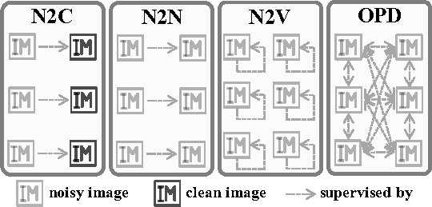

# One-Pot Multi-Frame Denoising

**The corresponding paper has been accepted as a Spotlight at the 33rd British Machine Vision Conference ([BMVC 2022](https://bmvc2022.mpi-inf.mpg.de/61/)), and an extended version is published on the International Journal of Computer Vision (IJCV).**

**Abstract:**

_The efficacy of learning-based denoising techniques is heavily reliant on the quality of clean supervision. Unfortunately, acquiring clean images in many scenarios is a challenging task. Conversely, capturing multiple noisy frames of the same field of view is feasible and natural in real-life scenarios. Thus, it is imperative to explore the potential of noisy data in model training and avoid the limitations imposed by clean labels. In this paper, we propose a novel unsupervised learning strategy called one-pot denoising (OPD), which is the first unsupervised multi-frame denoising method. OPD differs from traditional supervision schemes, such as supervised Noise2Clean, unsupervised Noise2Noise, and self-supervised Noise2Void, as it employs mutual supervision among all the multiple frames. This provides learning with more diverse supervision and allows models to better exploit the correlation among frames. Notably, we reveal that Noise2Noise is a special case of the proposed OPD. We provide two specific implementations, namely OPD-random coupling (OPD-RC) and OPD-alienation loss (OPD-AL), to achieve OPD during model training based on data allocation and loss refine, respectively. Our experiments demonstrate that OPD outperforms other unsupervised denoising methods and is comparable to non-transformer-based supervised N2C methods for several classic noise patterns, including additive white Gaussian noise, signal-dependent Poisson noise, and multiplicative Bernoulli noise. Additionally, OPD shows remarkable performance in more challenging tasks such as mixed-blind denoising, denoising random-valued impulse noise, and text removal._

**Priciple Comparison:**



**Method Demonstration:**


**Quantitative Evaluation:**


**Qualitative Evaluation:**


## Getting started

The below sections detail how to get set up for training under the OPD strategy including OPD-RC and OPD-AL using the ImageNet validation dataset.

### Python requirements

This code is tested with Python 3.8. Here's how to create a clean environment and install library dependencies:

```
conda create -n opd python=3.8
conda activate opd
conda install pytorch_gpu
python -m pip install --upgrade pip
pip install -r requirements.txt
```

This will install Pytorch and other dependencies used in this project.

### Preparing datasets for training and testing

This section describes how to add simulated noise to clean datasets including ImageNet, BSD300, KODAK, and SET14.

Firstly download and unzip the [ImageNet validation dataset](http://www.image-net.org/challenges/LSVRC/2012/nnoupb/ILSVRC2012_img_val.tar), [BSD300 dataset](https://www2.eecs.berkeley.edu/Research/Projects/CS/vision/bsds/BSDS300-images.tgz) and [KODAK](http://r0k.us/graphics/kodak/) into the corresponding directory under `./data`. [SET14]() has been prepared as a demonstrative dataset.

Here is how to add noise to the clean dataset:

```
# try python add_noise.py --help for available options
python add_noise.py --root_dir 'data/ILSVRC2012_img_val/' --tar_dir 'data/ILSVRC2012_img_val_noisy1/'
```

Note that the above code needs to be repeated m times and the final index should be changed to generate noisy datasets of m frames.

### Training networks

To train a modified U-Net on ImageNet validation set under OPD strategy:

```
# try python train.py --help for available options
python train.py --strategy RC --datadir ILSVRC2012_img_val_noisy
```

By default, this invocation will train a Gaussian denoising network using the ImageNet validation set. Upon completion, the training process produces a file called `network_final.pth` under the `models/OPD-RC_ILSVRC2012val_AWGN/` directory. In addition, if you want to train under OPD-AL, change the `--strategy` argument to `AL` in the above invocation.

### Testing using a trained network

Once you've trained a network, you can run a testing dataset through the network.

Suppose your training run results were stored under `models/OPD-RC_ILSVRC2012val_AWGN/`. Here's how to run a set of images through this network:

```
python test.py --strategy RC --testdata BSD300 --srcpath BSD300_noisy --tarpath BSD300
```

### Pre-trained networks

You can find pre-trained networks for denoising AWGN in the corresponding directory under the `model/`. 

## A Demo

We provide a demo on the SET14 dataset. You only need to run the following command, and the denoised images of SET14 will be found in the `results/OPD-RC_ILSVRC2012val_AWGN_SET14` directory. For the demo under OPD-AL, the operation is similar.

```
python demo.py 
```
